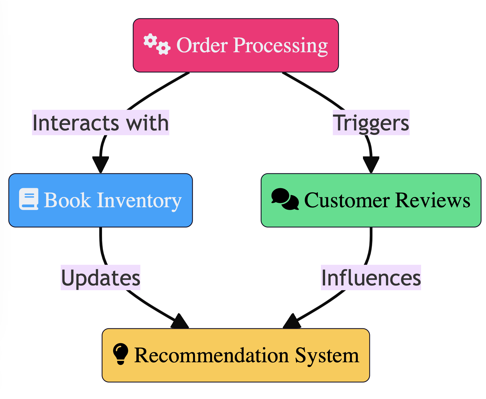

# 📚 BookStoreHub Event Storming

Event Storming session for the BookStoreHub, we delved deeper into the process, meticulously identifying and defining bounded contexts through the lens of events, commands, and their interactions. Here's the detailed exploration and collaborative synthesis of our findings.

### Team 1's Detailed Findings:
- **Events Identified**: `OrderPlaced`, `StockChecked`, `ReviewSubmitted`
- **Commands**: `CreateOrder`, `CheckStock`, `SubmitReview`
- **Chronological Ordering**: They started with `CreateOrder`, leading to `CheckStock`, and upon successful order placement, `OrderPlaced` event was triggered, concluding with `SubmitReview` resulting in `ReviewSubmitted`.
- **Boundaries Found**: 
    - **Order & Payment Processing**: Combining order creation, stock checking, and payment processing.
    - **Customer Engagement**: Encompassing reviews submission and handling.
- **Named Boundaries**: 
    - **Sales Transactions**: For Order & Payment Processing
    - **User Interaction**: For Customer Engagement

### Team 2's Detailed Findings:
- **Events Identified**: `OrderCreated`, `BookReserved`, `OrderCompleted`, `ReviewAdded`, `RecommendationUpdated`
- **Commands**: `PlaceOrder`, `ReserveBook`, `CompleteOrder`, `AddReview`, `UpdateRecommendation`
- **Chronological Ordering**: Began with `PlaceOrder`, leading to `ReserveBook`, then `OrderCompleted`, alongside `AddReview` leading to `ReviewAdded`, and finally, `UpdateRecommendation`.
- **Boundaries Found**: 
    - **Order Fulfillment**: Covering the entire order lifecycle.
    - **Inventory Management**: Focused on book reservation and stock updates.
    - **Customer Reviews**: Dedicated to review management.
    - **Recommendation Engine**: For updating book recommendations.
- **Named Boundaries**: 
    - **Order Processing**: For Order Fulfillment
    - **Stock Control**: For Inventory Management
    - **Feedback Loop**: For Customer Reviews
    - **Book Suggestions**: For the Recommendation Engine

### Collaborative Curation to Four Bounded Contexts:
During the collaboration session, a detailed discussion led to the identification of overlaps and distinctions within the proposed contexts. This was crucial for refining the final bounded contexts.

1. **Order Processing**:
    - **Why Merged/Renamed**: Team 1's "Sales Transactions" and Team 2's "Order Processing" were merged due to their overlapping concern with order lifecycle management. The name "Order Processing" was chosen for its direct relation to the core functionality.

2. **Book Inventory**:
    - **Why Merged/Renamed**: Team 2's "Stock Control" was expanded to "Book Inventory" to include not just stock levels but also book details management, recognizing that inventory encompasses more than just stock control.

3. **Customer Reviews**:
    - **Why Kept**: Both teams identified a customer feedback mechanism, though named differently. It was decided to keep this bounded context as "Customer Reviews" for its clear focus and to align with common industry terminology.

4. **Recommendation System**:
    - **Why Merged/Renamed**: Team 2's "Book Suggestions" directly aligned with the recommendation functionality. It was chosen over Team 1's broader "User Interaction" context, which was deemed too expansive and not solely focused on recommendations.

### Decision Rationale for Discarding/Merging Bounded Contexts:
- **Sales Transactions and Order Fulfillment into Order Processing**: Unified to focus on the order's lifecycle, eliminating redundancy between ordering and payment processes.
- **Stock Control into Book Inventory**: Recognized the need for a broader context that includes book details beyond stock management.
- **User Interaction discarded**: The specific functionalities of reviews and recommendations warranted distinct bounded contexts, making "User Interaction" too broad and non-specific.

This careful deliberation and synthesis of ideas from both teams led to a refined model that accurately represents the core domains of the BookStoreHub, setting a clear path for developing a microservices architecture that is aligned with business capabilities and technical requirements.




```
%%{init: {'theme':'base', 'themeVariables': { 'primaryFont': 'PS TT Commons'}}}%%
graph TD
    OP(fa:fa-cogs Order Processing):::primaryColor -->|Interacts with| BI(fa:fa-book Book Inventory):::secondaryColor
    OP -->|Triggers| CR(fa:fa-comments Customer Reviews):::actionColor
    BI -->|Updates| RS(fa:fa-lightbulb Recommendation System):::resultColor
    CR -->|Influences| RS

    classDef primaryColor fill:#FF1675,stroke:#130F25,stroke-width:0.6px,color:#EBEFF5,font-family:'PS TT Commons Bold';
    classDef secondaryColor fill:#00A3FF,stroke:#130F25,stroke-width:0.6px,color:#EBEFF5,font-family:'PS TT Commons Bold';
    classDef actionColor fill:#02E088,stroke:#130F25,stroke-width:0.6px,color:#000,font-family:'PS TT Commons Bold';
    classDef resultColor fill:#FFC942,stroke:#130F25,stroke-width:0.6px,color:#000,font-family:'PS TT Commons Bold';
```