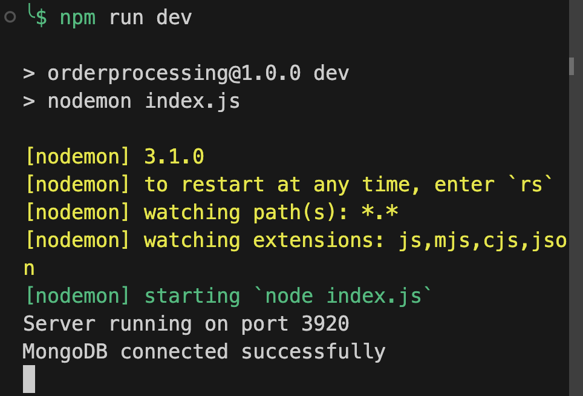
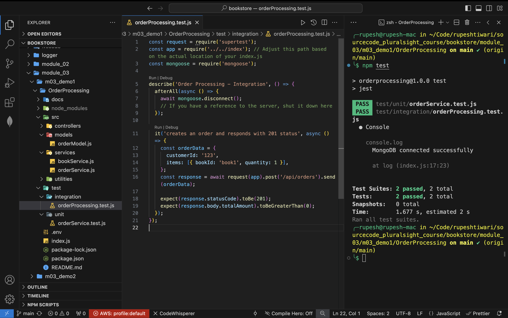
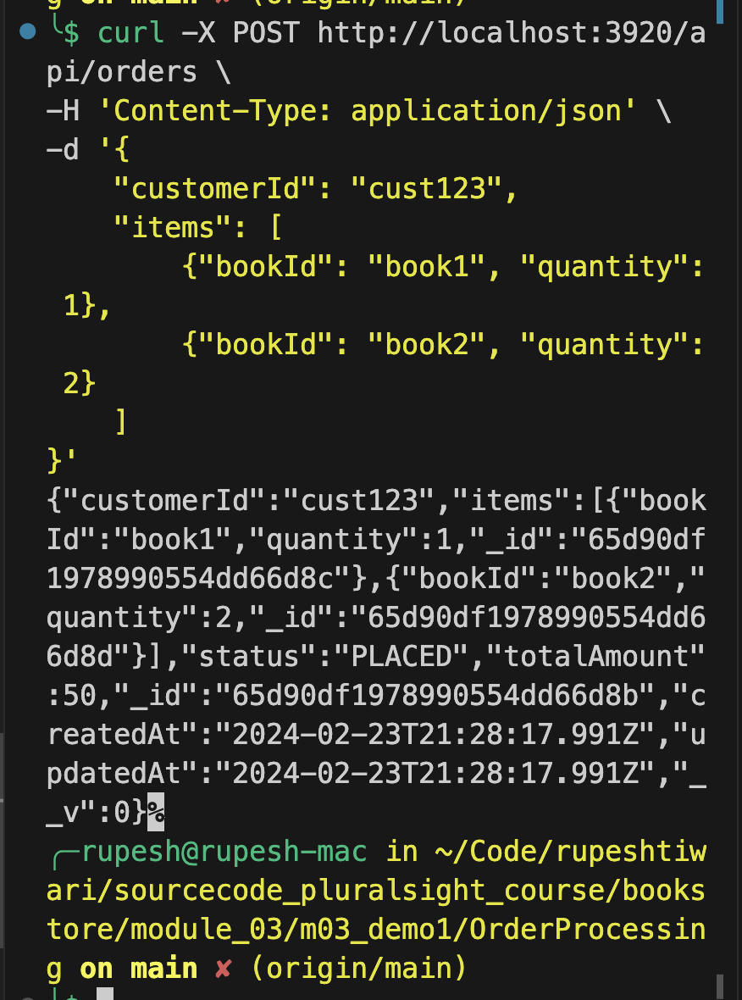
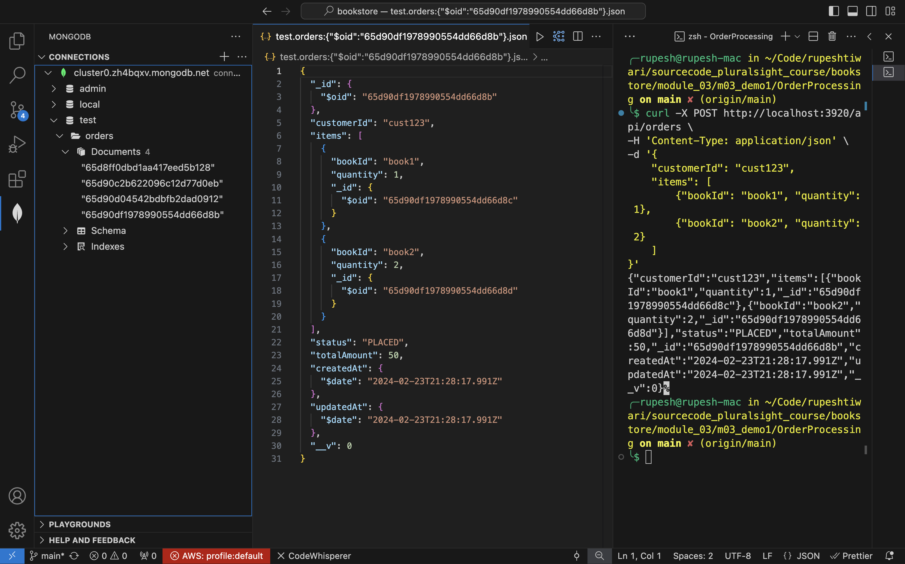

## Installations & Node.js Packages required
For the provided code to work as intended, you'll need to install several Node.js libraries. Below are the necessary installations along with their purposes:

1. **Express** for creating the HTTP server and defining routes:
   ```
   npm install express
   ```

2. **Mongoose** for MongoDB interactions, especially for defining models and executing database operations:
   ```
   npm install mongoose
   ```

3. **Dotenv** (optional) for managing environment variables, useful for configuring your database URI, port, and other sensitive information securely:
   ```
   npm install dotenv
   ```

4. **Supertest** for writing integration tests to test your Express routes:
   ```
   npm install supertest --save-dev
   ```

5. **Jest** for unit testing, assuming it's not already installed:
   ```
   npm install jest --save-dev
   ```

6. **Nodemon** (optional) for automatically restarting the node application when file changes in the directory are detected, useful during development:
   ```
   npm install nodemon --save-dev
   ```

To integrate these installations, ensure your `package.json` scripts section is updated for testing and development purposes. For instance:

```json
"scripts": {
  "start": "node index.js",
  "dev": "nodemon index.js",
  "test": "jest"
}
```

This setup allows you to start the server using `npm start`, use `npm run dev` for development with automatic restarts, and `npm test` to run your tests with Jest.

Before running your application, make sure to set up your MongoDB instance and specify the connection string in your `index.js` file or through an `.env` file if you're using `dotenv`. For `.env`, you would add your database URI like so:

```
MONGODB_URI=mongodb://localhost:27017/bookstorehub
```

And modify your `index.js` to use `dotenv`:

```javascript
require('dotenv').config();
// Use process.env.MONGODB_URI where you connect to MongoDB
```

With these libraries and setup, your Order Processing component in the BookStoreHub project should be fully operational for development and testing.


## Running OrderProcessing 

To run and test the Order Processing microservice, including setting up MongoDB, follow these steps:

### Step 1: Install MongoDB
You need a MongoDB instance. If you haven't installed MongoDB locally, you can download it from [the MongoDB website](https://www.mongodb.com/try/download/community) or use a cloud-based solution like MongoDB Atlas.

#### Local Installation:
- Follow the installation guide on the MongoDB website for your operating system.
- Once installed, start MongoDB. On many systems, this can be done with a service start command or by running `mongod` directly.

#### MongoDB Atlas:
- Sign up and create a cluster.
- Follow the connection instructions provided by Atlas to get your connection string.

### Step 2: Set Up Your Microservice Environment
Create an `.env` file in the root of your `OrderProcessing` project with the following content, adjusting the `MONGODB_URI` to match your MongoDB connection string (local or Atlas):

```
MONGODB_URI=mongodb+srv://user-admin:<password>@cluster0.zh4bqxv.mongodb.net/?retryWrites=true&w=majority
PORT=3920
```

### Step 3: Install Node.js Packages
Navigate to your `OrderProcessing` directory and run:

```bash
npm install
```

This installs Express, Mongoose, Jest, Supertest, and any other packages listed in your `package.json`.

### Step 4: Run the Microservice
To start your microservice, run:

```bash
npm start
```

If you're using `nodemon` for development (automatically restarts the server on code changes), you can run:

```bash
npm run dev
```

 

### Step 5: Testing
To test your microservice, ensure you've written tests in the `test` directory and run:

```bash
npm test
```



This executes unit and integration tests using Jest.

### Step 6: Executing order

Given that your app is running on `PORT=3920`, let's run  `curl` command to test the Order Processing service with a concrete example. Here's how you can test placing an order with updated port information:

```bash
curl -X POST http://localhost:3920/api/orders \
-H 'Content-Type: application/json' \
-d '{
    "customerId": "cust123",
    "items": [
        {"bookId": "book1", "quantity": 1},
        {"bookId": "book2", "quantity": 2}
    ]
}'
```
 
 You should see the response in console similar to: 




 
 You notice mongo db `test` db will get one entry for this order created similar to:

 


### MongoDB Considerations
- If you're running MongoDB locally, ensure the MongoDB service is running before starting your microservice.
- For cloud-based MongoDB (e.g., Atlas), ensure your IP is whitelisted and you've added your user credentials to the connection string in your `.env` file.

### Additional Notes
- MongoDB installation and running instructions might vary based on your operating system. Refer to official MongoDB documentation for specific details.
- The connection string (`MONGODB_URI`) format for MongoDB Atlas will differ and include your username, password, and cluster details.
- The `.env` file is crucial for configuring your application's environment variables without hardcoding sensitive information like database URIs.

Following these steps should get your Order Processing microservice up and running, ready for development and testing.


