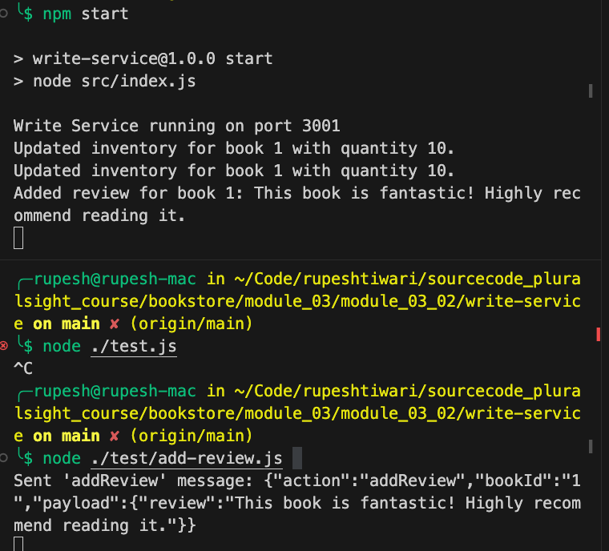

## Module 03: Demo -02

To install and run RabbitMQ on macOS using Homebrew, follow these steps. This guide assumes you have Homebrew installed on your macOS. If you haven't installed Homebrew yet, you can find the installation instructions at [https://brew.sh/](https://brew.sh/).

### Step 1: Install RabbitMQ

1. **Open a Terminal window** on your macOS.
2. **Update Homebrew** to ensure you have the latest package definitions. Run:
   ```bash
   brew update
   ```
3. **Install RabbitMQ** using Homebrew by running:
   ```bash
   brew install rabbitmq
   ```

### Step 2: Add RabbitMQ to Your PATH (Optional)

RabbitMQ's binaries are located in its `sbin` directory, which is not in the system's PATH by default. You can add it to your PATH to make running RabbitMQ commands more convenient.

1. **Find the RabbitMQ installation path**. If you installed RabbitMQ via Homebrew, it's typically located at `/opt/homebrew/opt/rabbitmq/sbin`. You can verify this path by running:
   ```bash
   brew info rabbitmq
   ```
   Look for the output lines mentioning where RabbitMQ is installed and the `sbin` directory.

2. **Edit your shell profile**. Depending on your shell, this might be `.bash_profile`, `.bashrc`, `.zshrc`, or another file. For example, if you're using bash, you can open `.bash_profile` in your home directory with a text editor:
   ```bash
   open -e ~/.bash_profile
   ```
   If you're using zsh, you might edit `.zshrc` instead:
   ```bash
   open -e ~/.zshrc
   ```

3. **Add RabbitMQ's `sbin` directory to your PATH**. Append the following line to your shell profile file (adjust the path if your Homebrew installation of RabbitMQ is located elsewhere):
   ```bash
   export PATH="$PATH:/opt/homebrew/opt/rabbitmq/sbin"
   ```
   


4. **Save the file and reload your shell profile**. For bash, you can use:
   ```bash
   source ~/.bash_profile
   ```
   For zsh, use:
   ```bash
   source ~/.zshrc
   ```

### Step 3: Start RabbitMQ

1. **Start RabbitMQ** using the Homebrew service command:
   ```bash
   brew services start rabbitmq
   ```
   This command will start RabbitMQ and configure it to run at boot.

### Step 4: Accessing RabbitMQ Management Interface

RabbitMQ comes with a management interface that runs on port 15672. To access it:

1. **Enable the RabbitMQ Management Plugin** (if it's not already enabled) by running:
   ```bash
   rabbitmq-plugins enable rabbitmq_management
   ```
   

   
2. **Open a web browser** and navigate to [http://localhost:15672/](http://localhost:15672/) to access the RabbitMQ Management Interface.

   

3. **Log in** with the default username and password, which are both `guest`.

   

You're now ready to use RabbitMQ on your macOS system.

For the second demo, "Resilient Writes through Command Models," we'll create a simplified version focusing on handling write operations for the "Book of the Month" feature, including inventory updates and new reviews. We'll use RabbitMQ to buffer these write operations during high loads. Below are step-by-step instructions and the complete Node.js source code for setting up and running this demo.

### Step 1: Install RabbitMQ
Before implementing the demo, ensure RabbitMQ is installed and running on your system. For macOS, RabbitMQ can be installed using Homebrew:

```bash
brew update
brew install rabbitmq
```

After installation, you can start RabbitMQ with:

```bash
brew services start rabbitmq
```

By default, RabbitMQ will be available on `http://localhost:15672/`, and you can use the default guest/guest credentials to log in.

### Demo 2: Directory Structure

```
write-service/
|-- src/
    |-- config/
        `-- amqpConfig.js
    |-- controllers/
        `-- inventoryController.js
    |-- models/
        `-- bookModel.js
    |-- queues/
        `-- bookQueue.js
    `-- index.js
|-- package.json
```


### Running the Demo

1. **Install Dependencies**: Run `npm install` inside the `write-service` directory.
2. **Start RabbitMQ**: Ensure RabbitMQ is running.
3. **Run the Service**: Execute `npm start` to run the service. This starts the consumer which listens for messages in the `bookUpdates` queue.

### Testing the System

You can publish messages to the `bookUpdates` queue using RabbitMQ's management interface or a script to simulate inventory updates or new reviews. For example:

1. **Execute the Script**: Navigate to the directory where your `sendAddReviewMessage.js` script is located and run it with Node.js:
   ```bash
   node sendAddReviewMessage.js
   ```

### Expected Outcome

Executing this script publishes an "addReview" message to the `bookUpdates` queue. Your consumer service should then process this message and perform the corresponding action, such as logging the review addition to the console or updating a database, depending on your implementation.

The console log initiated by the script will confirm the message was sent:
```
Sent 'addReview' message: {"action":"addReview","bookId":"1","payload":{"review":"This book is fantastic! Highly recommend reading it."}}
```

This output indicates your message was successfully placed onto the queue, and if your consumer service is set up correctly, it will handle this message according to the logic you've implemented for the "addReview" action. 

 
 