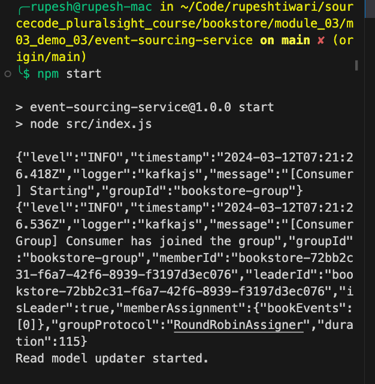
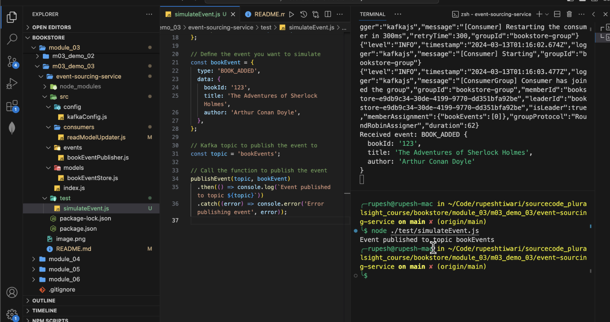

## Module 03: Demo 03

Installing and running Apache Kafka on macOS involves several steps because Kafka depends on Zookeeper for cluster management. Below are the steps to install Kafka and Zookeeper using Homebrew, create a Kafka topic, and verify that Kafka is running correctly.

### Step 1: Install Homebrew

First, ensure that Homebrew is installed on your macOS. If not, you can install it by running the following command in the Terminal:

```bash
/bin/bash -c "$(curl -fsSL https://raw.githubusercontent.com/Homebrew/install/HEAD/install.sh)"
```

### Step 2: Install Kafka and Zookeeper

Kafka requires Zookeeper to run, so you'll need to install both. You can do this easily with Homebrew:

```bash
brew install kafka
```


This command installs both Kafka and Zookeeper because Kafka has Zookeeper as a dependency.

### Step 3: Start Zookeeper

Before you start Kafka, you need to start Zookeeper. Homebrew makes it simple to start services:

```bash
brew services start zookeeper
```
 
### Step 4: Start Kafka

Once Zookeeper is up and running, you can start Kafka:

```bash
brew services start kafka
```


### Step 5: Verify Kafka and Zookeeper Are Running

You can check that Zookeeper and Kafka are running by looking at the list of services managed by Homebrew:

```bash
brew services list
```


You should see `kafka` and `zookeeper` in the list, each with a status of "started".

### Step 6: Create a Kafka Topic

Now that Kafka is running, you can create a topic. Let's create a topic named "test" with a single partition and only one replica:

```bash
kafka-topics --create --topic test --bootstrap-server localhost:9092 --partitions 1 --replication-factor 1
```


### Step 7: Verify the Topic Creation

Verify that the topic "test" has been created successfully:

```bash
kafka-topics --list --bootstrap-server localhost:9092
```


You should see "test" listed among the topics.

### Step 8: Test Producing and Consuming Messages

To ensure everything is set up correctly, you can test producing and consuming messages with the "test" topic.

- **Start a Kafka Consumer**: Open a new Terminal window and run:

```bash
kafka-console-consumer --topic test --from-beginning --bootstrap-server localhost:9092
```

- **Produce Messages to the Topic**: Open another Terminal window and run:

```bash
kafka-console-producer --topic test --bootstrap-server localhost:9092
```


Now, you can type messages into the producer terminal. Press Enter after each message, and you should see the message appear in the consumer terminal.

This confirms that Kafka is running correctly on your macOS, and you're ready to use it for your event sourcing and messaging needs in your applications.


Restart Services: Restart Zookeeper and Kafka services to resolve any transient issues:

```bash
brew services restart zookeeper
brew services restart kafka
```

### Directory Structure for Demo 3

```
event-sourcing-service/
|-- src/
    |-- config/
        `-- kafkaConfig.js
    |-- events/
        `-- bookEventPublisher.js
    |-- models/
        `-- bookEventStore.js
    |-- consumers/
        `-- readModelUpdater.js
    `-- index.js
|-- package.json
```


### Running the Demo

1.  **Ensure Kafka is Running**: Start your Kafka server and create the `bookEvents` topic if it hasn't been created yet.
2.  **Install Dependencies**: Run `npm install` in the `event-sourcing-service` directory.
3.  **Start the Service**: Execute `npm start` to run the service. It will listen for events on the Kafka topic and simulate updating a read model based on those events.
4.  


### Testing and Expected Outcome

Open Terminal 2 and run below script: 
```bash
node ./test/simulateEvent.js
```

**output should be:**

```js
Received event: BOOK_ADDED {
    bookId: '123',
    title: 'The Adventure of Sherlock Holmes',
    author: 'Arthur Conan Doyle'
}
```
 

 