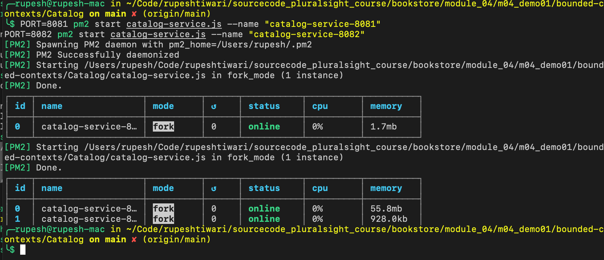
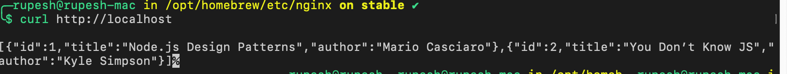
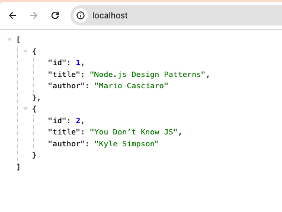
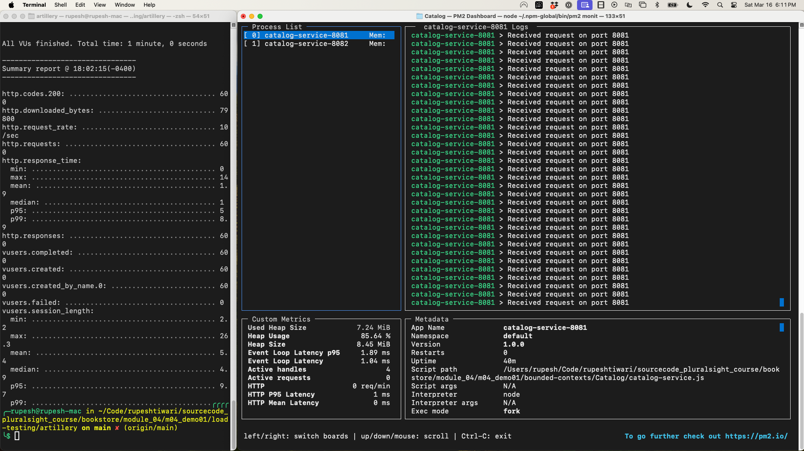
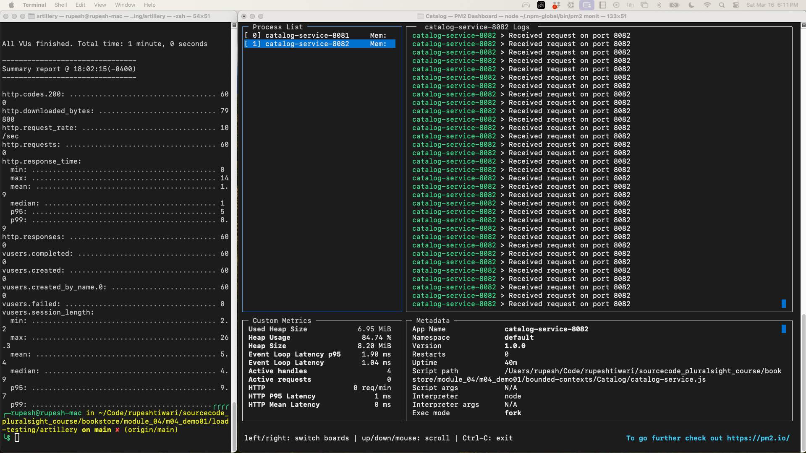

# BookStoreHub Load Balancer Demo

This project demonstrates the implementation of a software load balancer using NGINX to manage traffic across multiple instances of services within the BookStoreHub application. It showcases load balancing strategies, the setup of Node.js service instances using PM2, and conducting load tests using Artillery.

## Project Structure

```
BookStoreHub-Demo/
│
├── bounded-contexts/
│   ├── Catalog/
│   │   ├── catalog-service.js
│   │   └── package.json
│   │
│   ├── Ordering/
│   │   ├── ordering-service.js
│   │   └── package.json
│   │
│   └── Common/
│       └── ...
│
├── nginx/
│   ├── nginx.conf
│   └── sites-available/
│       └── bookstorehub
│
├── load-testing/
│   └── artillery/
│       └── loadtest.yml
│
├── monitoring/
│   └── pm2/
│       ├── ecosystem.config.js
│       └── README.md
│
└── README.md
```

## Getting Started

### Prerequisites

- Node.js and npm installed
- NGINX installed
- PM2 installed globally (`npm install pm2 -g`)
- Artillery installed globally (`npm install artillery -g`)

## Follow-along steps:

```bash
# Install PM2 and Artillery globally
npm install pm2 artillery -g

# Run two instances of Catalog service on different ports
PORT=8081 pm2 start catalog-service.js --name "catalog-service-8081"
PORT=8082 pm2 start catalog-service.js --name "catalog-service-8082"

# Check the status of the services
pm2 status

# Configure NGINX

# Check if the sites-available and sites-enabled directories exist. If not, create them.
sudo mkdir -p /opt/homebrew/etc/nginx/sites-available
sudo mkdir -p /opt/homebrew/etc/nginx/sites-enabled

# Copying the example site configuration to sites-available
sudo cp /Users/rupesh/Code/rupeshtiwari/sourcecode_pluralsight_course/bookstore/module_04/m04_demo01/nginx/sites-available/bookstorehub.example /opt/homebrew/etc/nginx/sites-available/bookstorehub

# Creating a symbolic link in sites-enabled
sudo ln -sf /opt/homebrew/etc/nginx/sites-available/bookstorehub /opt/homebrew/etc/nginx/sites-enabled/

# Copying the NGINX example configuration file
sudo cp /Users/rupesh/Code/rupeshtiwari/sourcecode_pluralsight_course/bookstore/module_04/m04_demo01/nginx/nginx.conf.with-symlink.example /opt/homebrew/etc/nginx/nginx.conf

# Testing the NGINX configuration for syntax errors
sudo nginx -t

# Reloading NGINX to apply the new configuration
# sudo nginx -s reload

# If using Homebrew's services:
brew services reload nginx
 
 
# Test Nginx configuration and reload
# nginx -t && nginx -s reload

# Test the load-balanced service with curl
curl http://localhost

# Load Testing

# Navigate to load-testing directory
cd /Users/rupesh/Code/rupeshtiwari/sourcecode_pluralsight_course/bookstore/module_04/m04_demo01/load-testing/artillery

# Start the load test with Artillery
artillery run loadtest.yml

# Show PM2 monitoring output
pm2 monit

``` 


## Setting Up
 
## 1. Install PM2 Globally & Run Services in 2 Instances
#### 1. **Install PM2 Globally:**
You might have missed installing PM2 globally. To install it, open your terminal and run:

```bash
npm install pm2@latest -g
```

#### 2. **Ensure the Installation Directory is in PATH:**
After installing PM2 globally, ensure the npm global installation directory is in your PATH. You can find out where npm installs global packages by running:

```bash
npm config get prefix
```

The output will be a directory path. For global installations, you need to ensure that `<npm-prefix>/bin` is in your system's PATH. For most Unix systems (like macOS and Linux), global packages might be installed in `/usr/local/bin` or `/usr/local`. On Windows, it could vary but often found in directories like `C:\Users\<YourUsername>\AppData\Roaming\npm`.

#### 3. **Add npm Global Bin Directory to PATH (if necessary):**
If after running `npm config get prefix` you find that the directory is not in your PATH, you'll need to add it manually.

- **On macOS/Linux**:
  Add the following line to your `.bashrc`, `.zshrc`, or equivalent configuration file:
  ```bash
  export PATH="$(npm config get prefix)/bin:$PATH"
  ```
  Then, reload your shell configuration with `source ~/.bashrc` or `source ~/.zshrc`, depending on which shell you use.

- **On Windows**:
  You can add the directory to your PATH via the System Properties > Environment Variables GUI, appending the path to the `Path` variable.

#### 4. **Verify PM2 Installation:**
After installation and ensuring the PATH is correctly set, you can verify the installation of PM2 by typing:

```bash
pm2 --version
```

This command should return the version of PM2 installed, confirming that it is correctly installed and recognized by your system.

#### 5. Run Pm2

```
PORT=8081 pm2 start catalog-service.js --name "catalog-service-8081"
PORT=8082 pm2 start catalog-service.js --name "catalog-service-8082"
```



 ## 2. Install NGINX on the machine u r testing or running demo

 ```bash
 brew install nginx
brew services start nginx
 ```

 ### Note on NGINX Configuration File Location

The location of the NGINX configuration file (`nginx.conf`) can vary based on your operating system and how NGINX was installed. In this demo, the example path is `/opt/homebrew/etc/nginx/nginx.conf`, which is common for NGINX installations on macOS with Homebrew.

Here are some typical locations for `nginx.conf` on different systems:

- **macOS (Homebrew)**: `/opt/homebrew/etc/nginx/nginx.conf`
- **Ubuntu/Debian (apt)**: `/etc/nginx/nginx.conf`
- **CentOS/RHEL (yum)**: `/etc/nginx/nginx.conf`
- **Windows**: `C:\nginx\nginx.conf` or wherever you extracted the NGINX zip file.

Please adjust the file paths in the instructions according to your NGINX installation. If you're unsure, you can often find the configuration file's location by running the command `nginx -t`, which tests the configuration and shows the file paths.

### Applying NGINX Configuration for BookStoreHub-Demo

This demonstration includes NGINX configuration examples to set up a load balancer for the BookStoreHub application. Note that the configuration file paths are based on a typical NGINX installation via Homebrew on macOS. If your NGINX installation is located elsewhere, please adjust the file paths accordingly.

## Configuration Steps

1. **Adapt Configuration Paths**:
   - The example configuration paths are set to `/opt/homebrew/etc/nginx/` which is common for NGINX installations via Homebrew on macOS. If you're using a different OS or installation method, ensure to use the correct path for your NGINX configuration files.

2. **Copy and Enable Site Configuration**:
   - Copy the content from `nginx/sites-available/bookstorehub.example` into a new file in your NGINX's `sites-available` directory. If this directory does not exist, you may need to create it or directly place and reference the configuration in NGINX's main configuration file.
   - Link this configuration in `sites-enabled` to enable it, or include it directly in your NGINX's main configuration file.

3. **Reload NGINX**:
   - After making changes, reload NGINX to apply the new configuration.
   ```bash
   sudo nginx -s reload
    ```


This adjusted guidance helps ensure that anyone trying to follow your demonstration can correctly locate their NGINX configuration files and understand how to apply your example configurations, regardless of their specific NGINX installation details.


## 3. Apply NGINX Configuration and Start Server at port :80 

### With symlink (Recommended)

 

### Setting Up `bookstorehub` in NGINX

1. **Create NGINX Configuration for BookStoreHub**:
   - Navigate to your NGINX configuration directory (`/opt/homebrew/etc/nginx/`).
   - Create a new file under `sites-available/` for your project. If `sites-available/` or `sites-enabled/` directories don't exist, you'll need to create them.

   ```bash
   cd /opt/homebrew/etc/nginx/
   mkdir -p sites-available
   mkdir -p sites-enabled
   nano sites-available/bookstorehub
   ```

2. **Edit the `bookstorehub` Configuration**:
   - Add the upstream and server block configuration into the `bookstorehub` file. Here's a simple example based on previous discussions:

   ```nginx
   upstream bookstore_backend {
       least_conn;  # Load balancing method
       server localhost:8081;
       server localhost:8082;
   }

   server {
       listen 80;
       location / {
           proxy_pass http://bookstore_backend;
           proxy_set_header Host $host;
           proxy_set_header X-Real-IP $remote_addr;
           proxy_set_header X-Forwarded-For $proxy_add_x_forwarded_for;
       }
   }
   ```

3. **Enable the BookStoreHub Site**:
   - Create a symbolic link from `sites-available/bookstorehub` to `sites-enabled/` to enable this configuration.

   ```bash
   ln -s /opt/homebrew/etc/nginx/sites-available/bookstorehub /opt/homebrew/etc/nginx/sites-enabled/
   ```

4. **Adjust the Main NGINX Configuration**:
   - Make sure your main `nginx.conf` includes the `sites-enabled/` directory so that it reads your new site configuration.

   ```bash
   nano /opt/homebrew/etc/nginx/nginx.conf
   ```
   
   - Add or ensure this line exists within the `http` block:
   
   ```nginx
   include /opt/homebrew/etc/nginx/sites-enabled/*;
   ```

   Simplified `nginx.conf` with symlink support

   ```bash
   # User directive is ignored by NGINX if it's started by non-root users (common in environments like macOS with Homebrew)
# worker_processes directive defines the number of worker processes
worker_processes auto;

events {
    worker_connections 1024; # The maximum number of simultaneous connections that can be opened by a worker process
}

http {
    include       mime.types;  # Include file types configurations
    default_type  application/octet-stream;

    # Logging settings
    access_log /opt/homebrew/var/log/nginx/access.log;
    error_log  /opt/homebrew/var/log/nginx/error.log warn;

    # Basic settings for sendfile, keepalive, and client body buffer size
    sendfile        on;
    keepalive_timeout  65;
    client_max_body_size 16m; # Adjust as needed

    # Load configuration files for the default server block.
    include /opt/homebrew/etc/nginx/conf.d/*.conf;

    # Load the server block configurations from sites-enabled directory
    include /opt/homebrew/etc/nginx/sites-enabled/*;
}

   ```


### Solving NGINX Reload Issues

The errors you're encountering seem related to PID file issues and the attempt to use `systemctl`, which isn't available on macOS. Instead, macOS uses `brew services` to manage services like NGINX.

#### If NGINX is Already Running but Can't Reload:

- **Try Stopping and Starting NGINX** with Homebrew services to properly reload configurations:

  ```bash
  brew services stop nginx
  brew services start nginx
  ```

#### If the Above Doesn't Work:

- **Manually Start NGINX with the Correct PID File Path**:
  
  - You might need to specify the PID file explicitly if it's not found or if NGINX can't manage its process correctly. Adjust the command to run NGINX in the foreground for testing:

  ```bash
  /opt/homebrew/opt/nginx/bin/nginx -g 'daemon off;'
  ```

  - For regular background operation without manually specifying PID paths, ensure the `nginx.conf` file correctly specifies the PID file location, which should match NGINX's expectations based on its installation via Homebrew. This is typically set in the top of your `nginx.conf`:

  ```nginx
  pid /opt/homebrew/var/run/nginx.pid;
  ```
 

After following these steps, your `bookstorehub` site configuration should be active, and NGINX should route traffic to your Node.js application instances according to the load balancing rules you've set up.

#### Finally run curl to see server is running

```bash
curl http://localhost
```





## 4. Run Load Testing

To perform load testing on your Catalog service and monitor the performance using PM2, follow these steps. This will help you understand how your application behaves under stress and ensure it's capable of handling production-level traffic.

### Step 1: Install Artillery for Load Testing

If you haven't installed Artillery yet, you can do so globally using npm:

```bash
npm install -g artillery
```

### Step 2: Create the `loadtest.yml` File for Artillery

Create a `loadtest.yml` file in your project directory. This file will define your load test scenario, including the target URL, the duration of the test, and the arrival rate of virtual users. Here’s an example configuration for your setup:

```yaml
config:
  target: 'http://localhost'  # Target URL to load test
  phases:
    - duration: 60  # Test for 60 seconds
      arrivalRate: 10  # 10 users arriving per second

scenarios:
  - flow:
    - get:
        url: "/"  # Assuming the root URL responds with the book catalog
```

This configuration will simulate a scenario where 10 new users arrive every second for 60 seconds, making HTTP GET requests to the root URL.

### Step 3: Run the Load Test

With your `loadtest.yml` ready, run the load test using Artillery from the command line:

```bash
artillery run loadtest.yml
```

Artillery will execute the load test based on the parameters defined in `loadtest.yml` and output the results, including the total requests made, response times, and any errors encountered.

### Step 4: Monitor Performance with PM2

While the load test is running, you can monitor the performance of your Catalog service instances using PM2's built-in monitoring tool.

1. **Open a new terminal window** and use the following command to launch PM2's monitoring interface:

```bash
pm2 monit
```

2. In the PM2 monitoring interface, you can observe the CPU and memory usage of your Node.js instances. Pay special attention to any instances that might be under more stress than others.

### Step 5: Analyze the Results

After the load test completes, review the output from Artillery for any indicators of performance issues, such as high response times or error rates. Additionally, analyze the data from PM2's monitoring to determine how the load impacted your service's resources.

- **Response Times**: Look at the average, median, and 95th percentile response times to understand the application's responsiveness under load.
- **Error Rates**: High error rates might indicate problems that need to be addressed in your application or infrastructure.
- **Resource Usage**: PM2 monitoring data will help you see if your instances are running out of CPU or memory resources under load.

### Step 6: Make Adjustments Based on Findings

Based on your findings from the load test and monitoring:

- **Optimize Application Performance**: Identify any bottlenecks or inefficient code paths in your application that could be optimized.
- **Adjust Infrastructure**: Consider scaling up your infrastructure or making configuration changes to NGINX if you find that your current setup can't handle the desired load.

By following these steps, you can gain valuable insights into your application's performance and scalability, ensuring that it is prepared to handle real-world traffic scenarios efficiently.




