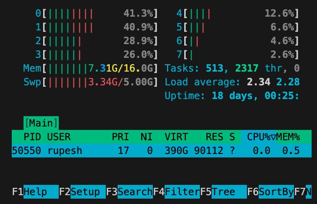

#### Clip 2: Authentication and Authorization (10 mins)

**Description**: Dive into securing microservices using authentication and authorization.

**Concepts Learned**:

-   JWT (JSON Web Tokens)
-   OAuth2.0
-   Role-Based Access Control

**Demo**: Implementing JWT authentication for the BookStoreHub.

**Demo Initial**:

-   Introduction to JWT and its significance in microservices.
-   Explanation of how JWT works.

**Demo Code**:

```js
const jwt = require('jsonwebtoken');

// Create a JWT token
const token = jwt.sign({ userId: '12345' }, 'secretKey', { expiresIn: '1h' });

// Verify JWT token
jwt.verify(token, 'secretKey', (err, decoded) => {
  if (err) {
    console.error('Token verification failed:', err);
  } else {
    console.log('Decoded JWT:', decoded);
  }
});

```


**After Code Explanation**:

-   The code demonstrates how to create and verify a JWT token.
-   JWTs are used for user authentication and ensuring data integrity.

**Steps to Run Demo Source Code**:

1.  Install the `jsonwebtoken` package: `npm install jsonwebtoken`
2.  Save the above code in a file named `jwtDemo.js`.
3.  Run the code using the command: `node jwtDemo.js`
4.  Observe the generated JWT and its decoded version in the console.

---

**Module 4: Microservices Security Best Practices** **Demo 2: Implementing Rate Limiting with API Gateway**

**Learning Goals:** Understand the importance of rate limiting in microservices security and how to implement it using an API Gateway.

**Concepts Covered:** Rate Limiting, API Gateway, Security Policies.

**Total Time:** 10 mins

**Description:** In this demo, we'll explore one of the essential security practices in microservices architecture – Rate Limiting. Rate limiting helps prevent abuse and overuse of your microservices by limiting the number of requests from a client within a specific time frame.

**Before Code:** We have an API Gateway that routes requests to various services. However, without rate limiting, a client could potentially flood our services with requests, leading to performance issues and potential service disruptions.

**Code:** We'll modify our API Gateway to include rate limiting for incoming requests. Specifically, we'll use the 'express-rate-limit' middleware to enforce a limit on the number of requests a client can make to our services within a minute.

 

```js
const express = require('express');
const rateLimit = require('express-rate-limit');
const app = express();
const PORT = 3000;

// Rate limiting middleware
const limiter = rateLimit({
  windowMs: 1 * 60 * 1000, // 1 minute
  max: 100, // limit each IP to 100 requests per windowMs
});

// Apply rate limiting to the API routes
app.use('/api/', limiter);

app.all('/api/*', (req, res) => {
  // Forward the request to the respective service
  // For simplicity, just sending a response here
  res.send('Request forwarded to service with security policies!');
});

app.listen(PORT, () => {
  console.log(`Secure API Gateway running on http://localhost:${PORT}`);
});`` 
```
**After Code:** With rate limiting in place, our API Gateway now ensures that no client can make more than 100 requests per minute. If a client exceeds this limit, they will receive a '429 Too Many Requests' error.

**Demo:** During the demo, we'll run a flood of requests to our API Gateway to show how rate limiting works in practice. We'll observe that when the limit is exceeded, clients receive a '429' error.

**Summary:** Rate limiting is a crucial security practice in microservices architecture. It helps protect your services from abuse and ensures fair usage of resources. By implementing rate limiting in your API Gateway, you can enhance the security and stability of your microservices.


---

#### Clip 4: Data Encryption and Secure Communication (8 mins)

**Description**: Techniques to ensure data security and secure communication between services.

**Concepts Learned**:

-   Data Encryption
-   HTTPS
-   Mutual TLS

**Demo**: Implementing data encryption for sensitive data in the BookStoreHub.

**Demo Initial**:

-   Introduction to data encryption and its importance.
-   Explanation of symmetric and asymmetric encryption.

**Demo Code**:

```javascript
const crypto = require('crypto');

const secret = 'bookStoreSecret';
const text = 'SensitiveData';

// Encrypt data
const cipher = crypto.createCipher('aes-256-cbc', secret);
let encrypted = cipher.update(text, 'utf8', 'hex');
encrypted += cipher.final('hex');

// Decrypt data
const decipher = crypto.createDecipher('aes-256-cbc', secret);
let decrypted = decipher.update(encrypted, 'hex', 'utf8');
decrypted += decipher.final('utf8');

console.log('Encrypted:', encrypted);
console.log('Decrypted:', decrypted);

```


**After Code Explanation**:

-   The code demonstrates symmetric encryption using the AES algorithm.
-   Data is encrypted and then decrypted to its original form.

**Steps to Run Demo Source Code**:

1.  Save the above code in a file named `encryptionDemo.js`.
2.  Run the code using the command: `node encryptionDemo.js`
3.  Observe the encrypted data and its decrypted version in the console.





## Checklist

- What new npm packages to install for this module?
- What are the additional libraries I need to keep up to date? like update curl, verify node.js server is etup to use TLS1.2 or TLS 1.3
  ```
  brew upgrade curl
  ``` 
- To check your TLS versio n run below script
 ```
 openssl s_client -connect localhost:3000

 ## output 
 Protocol  : TLSv1.3
 ```
