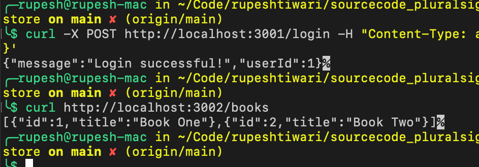

# Module 6 Demo : Implementing Strangler Pattern with Kubernetes and Docker

## Overview:
This demo showcases the deployment of an Authentication service and an Inventory service as separate microservices using Kubernetes on Minikube. By employing port forwarding, we simulate the effect of the Strangler Pattern, enabling gradual migration from a monolithic architecture to microservices.
 

## Prerequisites

Before running the demo, ensure the following tools are installed and configured on your system. The instructions below are tailored for Mac, Windows, and Linux users.

### Docker Desktop

Docker Desktop is a streamlined desktop application that includes Docker and Docker Compose. It is essential for building and running containerized applications.

- **Mac**: Download and install Docker Desktop for Mac from [Docker Hub](https://hub.docker.com/editions/community/docker-ce-desktop-mac/). After installation, open the Docker Desktop application to start the Docker daemon.
  
- **Windows**: Download and install Docker Desktop for Windows from [Docker Hub](https://hub.docker.com/editions/community/docker-ce-desktop-windows/). Once installed, launch Docker Desktop to get the Docker daemon running. Ensure you have WSL 2 installed and set as the default. Instructions can be found [here](https://docs.docker.com/docker-for-windows/wsl/).
  
- **Linux**: Install Docker Engine following the instructions for your specific Linux distribution [here](https://docs.docker.com/engine/install/). Docker Compose must be installed separately using the instructions found [here](https://docs.docker.com/compose/install/). To start the Docker daemon, use:
    ```bash
    sudo systemctl start docker
    ```

### kubectl

`kubectl` is a command-line tool that allows you to run commands against Kubernetes clusters.

- Download and install instructions for `kubectl` are available [here](https://kubernetes.io/docs/tasks/tools/install-kubectl/). Ensure to follow the instructions specific to your operating system.

### Minikube

Minikube is a tool that lets you run Kubernetes locally. Minikube runs a single-node Kubernetes cluster on your personal computer.

- Installation instructions for Minikube are available [here](https://minikube.sigs.k8s.io/docs/start/). Choose the instructions that match your operating system.

## Starting the Demo

Once you have the necessary prerequisites installed, follow these steps to run the demo:

1. **Start Docker Desktop**:
    - **Mac/Windows**: Docker Desktop should automatically start the Docker daemon upon launching the application. Verify by looking for the Docker icon in your menu bar (Mac) or system tray (Windows) indicating that Docker is running.
    - **Linux**: Ensure the Docker daemon is running by executing `sudo systemctl start docker` in your terminal.

2. **Start Minikube**:
    - Open a terminal window and start Minikube with `minikube start`. This command will initiate a local Kubernetes cluster.

3. **Proceed with Building Docker Images and Deploying to Kubernetes**:
    - Follow the specific steps in your demo instructions for building Docker images and deploying services to Minikube.

Please ensure that Docker Desktop (or the Docker daemon on Linux) and Minikube are running before proceeding with the demo steps that involve building Docker images or interacting with the Kubernetes cluster.

---


## Steps:

### Step 1: Start Minikube
Ensure Minikube is running.
```bash
minikube start
```

### Step 2: Build Docker Images Locally in Minikube's Docker Environment
Before building your Docker images, switch to Minikube's Docker environment:
```bash
eval $(minikube -p minikube docker-env)
```
Build the Docker images for both the Authentication service and the Inventory service:
```bash
# Navigate to /module_06/m06_demo01/m06_demo01_after/bookstore/
# Build Auth Service Docker Image
cd auth-service
docker build -t my-auth-service:latest .

# Build Inventory Service Docker Image
cd ../inventory-service
docker build -t inventory-service:latest .
```

### Step 3: Deploy Services to Minikube
Deploy both services using their Kubernetes manifests:
```bash
# Deploy Auth Service
cd .. 
kubectl apply -f kubernetes/auth-service/deployment.yaml
kubectl apply -f kubernetes/auth-service/service.yaml

# Deploy Inventory Service
kubectl apply -f kubernetes/inventory-service/deployment.yaml
kubectl apply -f kubernetes/inventory-service/service.yaml
```

### Step 4: Port Forwarding for Direct Access
Instead of configuring Ingress, use port forwarding to access the services directly for this demo:
```bash
# Port Forward Auth Service
kubectl port-forward svc/auth-service 3001:3001 &

# Port Forward Inventory Service
kubectl port-forward svc/inventory-service 3002:3002 &
```

### Step 5: Access and Test Services
Test the Authentication service login endpoint:

```bash
curl -X POST http://localhost:3001/login -H "Content-Type: application/json" -d '{"username": "user1", "password": "pass1"}'

# output
Handling connection for 3001
{"message":"Login successful!","userId":1}
 

# Test the Inventory service books endpoint:
curl http://localhost:3002/books

# output 
[{"id":1,"title":"Book One"},{"id":2,"title":"Book Two"}]  
```



#### Strangler Pattern:
- **Before**: Initially, both login and book listing functionalities were part of a monolithic application running on a single port.
- **After**: With the Strangler Pattern, we've successfully migrated the login functionality to a separate Authentication microservice, while the Inventory service handles book listings. Both are now running independently and can be accessed through their respective ports, simulating the process of gradually strangling the monolithic application.

#### What We Achieved:
- Demonstrated the separation of concerns by splitting the monolithic application into microservices.
- Simplified deployment and scaling of individual services.
- Enabled independent development and deployment cycles for each microservice.

#### Next Steps:
- Implement API Gateway to manage service routing and unify access points.
- Explore service discovery mechanisms for dynamically locating services within the cluster.
- Integrate Continuous Integration/Continuous Deployment (CI/CD) pipelines for automated testing and deployment.

#### Best Practices:
- Keep each microservice focused on a single responsibility.
- Use Kubernetes liveness and readiness probes for health checks.
- Ensure proper resource limits and requests are set for each pod.
- Adopt a GitOps workflow for Kubernetes resource management.

 