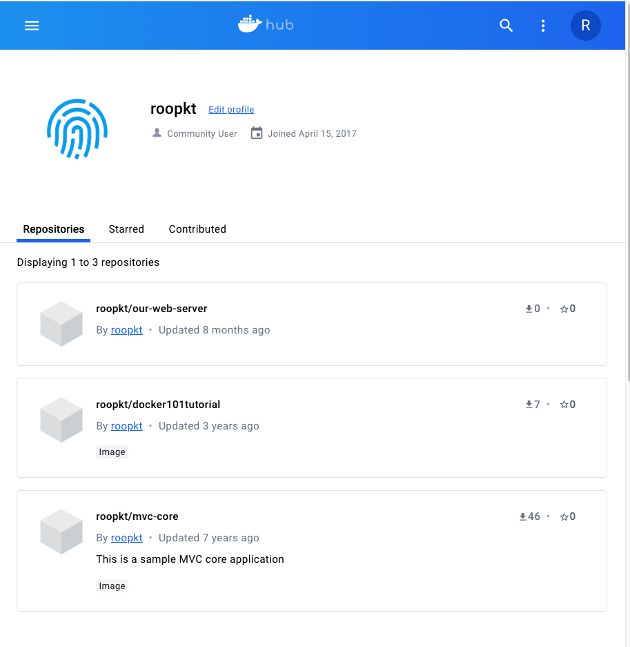
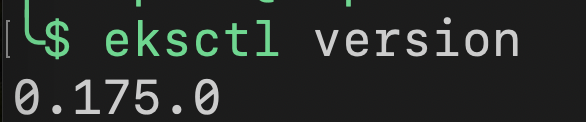
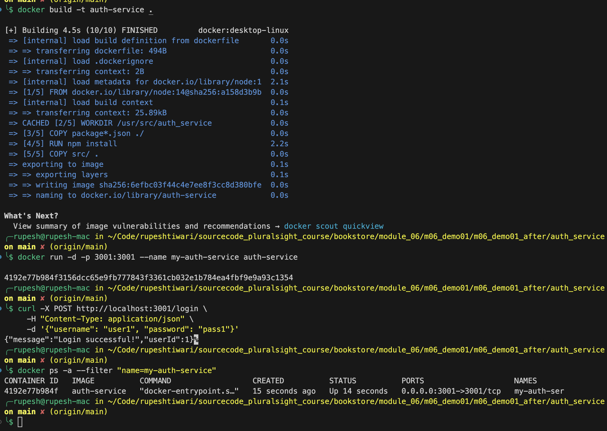

# Module 6 Demo 

## Prerequisites

Before you can run this demo, ensure you have the following installed and set up:

- **Docker Desktop**: Download and install Docker Desktop from the [official Docker website](https://www.docker.com/products/docker-desktop). This application includes everything you need to run Docker and Docker Compose on either Mac or Windows.

- **Docker Daemon**: Make sure the Docker Desktop application is running. This will automatically start the Docker daemon in the background. The Docker daemon must be running to build Docker images and run containers.

Create docker profile signup 
Docker profile page to get your user name 



AWS CLI installed and configured. Installation guide
aws --version (confirg)
eksctl tool installed for simplifying the cluster creation on EKS. Installation guide
eksctl version
kubectl installed for Kubernetes command-line interaction. Installation guide



## Running the Demo

Follow these steps to build and run the authentication service container:

### Build the Docker Image

First, you'll need to build the Docker image for the authentication service. Open a terminal and navigate to the directory containing your `auth_service` project. Once there, execute the following command to build your Docker image:

```bash
docker build -t auth-service .
```

This command tells Docker to build an image based on the Dockerfile in the current directory and tag it (`-t`) as `auth-service`.

### Run the Docker Container

After the image has been successfully built, you can start a container based on this image. Run the following command to start the container in detached mode (`-d`), map port 3001 from the container to port 3001 on your host machine, and name the container `my-auth-service`:

```bash
docker run -d -p 3001:3001 --name my-auth-service auth-service
```

### Confirm the Container Status

To ensure that the container is running as expected, use the following command to list all containers and filter by the name `my-auth-service`:

```bash
docker ps -a --filter "name=my-auth-service"
```

Look for your container in the list, and check its STATUS column to confirm it's in the "Up" state.

### Test the Service

With the container running, you can test the authentication functionality by sending a `POST` request to the `/login` endpoint. Use the `curl` command to make this request:

```bash
curl -X POST http://localhost:3001/login \
     -H "Content-Type: application/json" \
     -d '{"username": "user1", "password": "pass1"}'
```

This command sends a JSON payload with a username and password to the login endpoint. If the authentication is successful, you should receive a response indicating a successful login.

---

By following these steps, you'll be able to build, run, and test the authentication service in a Docker container, showcasing the process of isolating and containerizing a service as part of transitioning to a microservices architecture.



 **GitHub Repository and Secrets Configuration**
- **GitHub Repository**: Ensure your code is pushed to a GitHub repository if your CI/CD pipeline is GitHub Actions-based.
- **GitHub Secrets**: Configure necessary secrets in your GitHub repository:
  - `AWS_ACCESS_KEY_ID` and `AWS_SECRET_ACCESS_KEY` for AWS authentication.
  - Any other required secrets, such as database credentials or API keys, your application might need.

In the GitHub user interface, to create secrets for GitHub Actions, you'll typically follow these steps:

1. Navigate to your repository on GitHub.
2. Click on the "Settings" tab at the top of the repository.
3. On the left sidebar, you'll see a section named "Secrets and variables". Click on it to expand the options.
4. Choose "Actions" from the dropdown if it's not already selected.
5. You'll see a button or link that says "New repository secret" or something similar, which allows you to add a new secret.

For each secret, you will:

1. Enter a name in the "Name" input field.
2. Enter the secret value in the "Value" input field.
3. Click "Add secret" or "Save secret" to store it.

Once created, you can use these secrets in your GitHub Actions workflow by referencing them with the `${{ secrets.NAME }}` syntax, where `NAME` is the name you gave to your secret.


---

 deploy/
├── eks/
│   ├── k8s-deployment.yaml
│   └── k8s-service.yaml
└── minikube/
    ├── k8s-deployment.yaml
    └── k8s-service.yaml


## CI/CD Testing Manually

Let's revise the steps with the correct usage of Kustomize for deploying to both Minikube and Amazon EKS. Here is the updated workshop readme with all the necessary commands and steps included.
Certainly! Here is the revised guide, with the creation of the EKS cluster at the beginning due to its lengthy process time. 

### Pre-Requisites:

1. AWS CLI: Install and configure the AWS CLI. [AWS CLI Installation Guide](https://docs.aws.amazon.com/cli/latest/userguide/install-cliv2.html)
2. Docker: Install Docker for building and pushing Docker images. [Docker Installation Guide](https://docs.docker.com/get-docker/)
3. eksctl: Install the eksctl tool for easy EKS cluster creation. [eksctl Installation Guide](https://docs.aws.amazon.com/eks/latest/userguide/eksctl.html)
4. kubectl: Install kubectl for Kubernetes command-line interaction. [kubectl Installation Guide](https://kubernetes.io/docs/tasks/tools/install-kubectl/)
5. Minikube: Install and start Minikube for local Kubernetes deployment. [Minikube Installation Guide](https://minikube.sigs.k8s.io/docs/start/)

### Verify the Installations:

```bash
aws --version
docker --version
eksctl version
kubectl version --client
minikube version
```

### Create Amazon EKS Cluster

Start by creating the EKS cluster since it takes more time to become operational.

```bash
eksctl create cluster --name my-auth-service-cluster --version 1.29 --region us-east-1 --nodegroup-name standard-workers --node-type t2.medium --nodes 3 --nodes-min 1 --nodes-max 4 --managed
```

**Note**: The EKS cluster creation can take 10-15 minutes. Proceed with the following steps while waiting for the cluster to be ready.

### Create Amazon ECR Repository

Create the ECR repository if it doesn't already exist.

```bash
aws ecr create-repository --repository-name my-auth-service --region us-east-1
```

**Note**: This step only needs to be done if the repository doesn't already exist.

### Minikube Testing Steps 

For deploying locally with Minikube, it's crucial to ensure that Minikube uses its Docker environment to build your Docker images. This ensures that the image is available locally within Minikube's Docker environment, allowing the Kubernetes deployment to locate and use the image without pulling from an external registry like ECR.

Here's a revised guide for deploying your application to Minikube from scratch, ensuring all resources are properly set up and tested:

### Step 1: Start Minikube
Start or restart Minikube to ensure a clean environment.
```bash
minikube start
```

### Step 2: Set Docker Environment to Minikube
Configure your shell to use Minikube's Docker daemon and build docker image. 

```bash
eval $(minikube -p minikube docker-env)
# Build Docker Image Locally in Minikube's Docker Environment
# Navigate to your application directory and build the Docker image.
cd ~/Code/rupeshtiwari/sourcecode_pluralsight_course/bookstore/module_06/m06_demo01/m06_demo01_after/auth_service
docker build -t my-auth-service:latest .
```

### Step 3: Deploy to Minikube
Apply the Kubernetes manifests to create the deployment and service in Minikube.
```bash
kubectl apply -f deploy/minikube/k8s-deployment.yaml
kubectl apply -f deploy/minikube/k8s-service.yaml
```

### Step 4: Verify Deployment
Check the status of the deployed pods to ensure they are running.
```bash
kubectl get pods
```
If you encounter `ImagePullBackOff` or `ErrImagePull`, it indicates that Kubernetes cannot find the local image. Ensure Step 2 was executed correctly to use Minikube's Docker environment.

### Step 5: Forward Port to Access the Service
Forward a local port to the service's port to access your application. This step makes your service accessible via `localhost`:

```bash
kubectl port-forward svc/auth-service 8080:3001
```

### Step 6: Test the Auth Service
In new terminal, Use `curl` to test the `/login` endpoint of your application:

```bash
# Then, use the curl to login
curl -X POST http://localhost:8080/login -H "Content-Type: application/json" -d '{"username": "user1", "password": "pass1"}'     

# Expected output
{"message":"Login successful!","userId":1}
```

If you encounter any issues accessing the service or the `curl` command doesn't work as expected:
- Double-check the service and deployment configurations.
- Make sure the application within the Docker container is listening on the correct port (as specified in the Kubernetes manifest).
- Ensure the `curl` command is using the correct URL and port.

### Cleanup
To start fresh or after testing, you can delete the created resources and images.

```bash
kubectl delete -f deploy/minikube/k8s-deployment.yaml
kubectl delete -f deploy/minikube/k8s-service.yaml
minikube docker-env -u
docker rmi my-auth-service:latest
minikube stop
```
Restarting Minikube or executing `eval $(minikube -p minikube docker-env -u)` will revert your Docker environment back to the default.

### Tag and Push Docker Image to ECR

After the Docker image is built, tag it and push it to the ECR repository.

```bash
aws ecr get-login-password --region us-east-1 | docker login --username AWS --password-stdin 423735920800.dkr.ecr.us-east-1.amazonaws.com
docker tag my-auth-service:latest 423735920800.dkr.ecr.us-east-1.amazonaws.com/my-auth-service:latest
docker push 423735920800.dkr.ecr.us-east-1.amazonaws.com/my-auth-service:latest
```

### Deploy to Amazon EKS

Once the EKS cluster is ready:

```bash
aws eks --region us-east-1 update-kubeconfig --name my-auth-service-cluster

cd ~/Code/rupeshtiwari/sourcecode_pluralsight_course/bookstore/module_06/m06_demo01/m06_demo01_after/auth_service/deploy/eks
kubectl apply -f k8s-deployment.yaml
kubectl apply -f k8s-service.yaml

kubectl get deployments && kubectl get pods --watch
```

### Test the Auth Service in Amazon EKS

Retrieve the LoadBalancer's external IP or hostname to test the service in EKS.

```bash
SERVICE_IP=$(kubectl get svc my-auth-service -o jsonpath='{.status.loadBalancer.ingress[0].hostname}')
curl -X POST http://${SERVICE_IP}/login -H "Content-Type: application/json" -d '{"username": "user1", "password": "pass1"}'
```

### Cleanup

After testing, clean up resources to avoid unnecessary charges.

```bash
kubectl delete -f deploy/overlays/eks/k8s-deployment.yaml
eksctl delete cluster --name my-auth-service-cluster
aws ecr delete-repository --repository-name my-auth-service --region us-east-1 --force
```

**Note**: Adjust the directory paths and resource names as necessary based on your specific environment and naming conventions. Ensure the AWS CLI is properly configured with the correct permissions before executing these commands. If you've encountered any errors or need further clarification, please let me know!

## Appendix

### Minikube related scripts

```bash
# Delete and Recreate Minikube Cluster:
minikube delete
minikube start


# Delete the Existing Pods: To force Kubernetes to create new pods which will use the newly confirmed Docker image, delete the existing pods with the ImagePullBackOff status.
kubectl delete pods --selector=app=auth-service
```

### AWS related scripts
```bash
# Delete Existing CloudFormation Stack
aws cloudformation delete-stack --stack-name eksctl-my-auth-service-cluster-cluster

# Wait for the stack to be completely deleted. You can check the status with:
aws cloudformation describe-stacks --stack-name eksctl-my-auth-service-cluster-cluster
```

### Docker related scripts
```bash
# List container by name
docker ps -a --filter "name=my-auth-service"

# Stop the Existing Container:
docker stop my-auth-service

# Remove the Existing Container:
docker rm my-auth-service

# Inspect the container logs
docker logs my-auth-service
```


